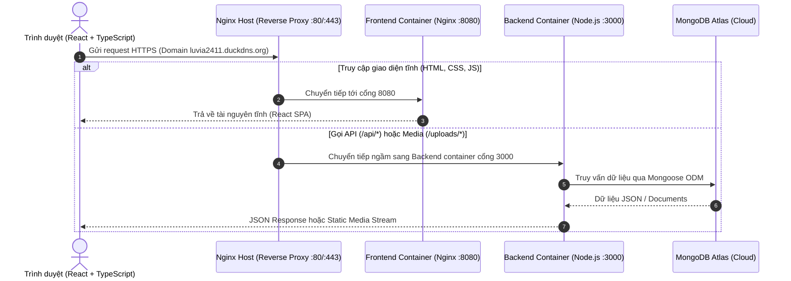

# 💖 Luvia — Interactive Romantic & Emotional Memory Sharing Platform

<p align="center">
  
  
  
  
  
  
  
  
  
  
</p>

---

## 📖 Mục Lục
- [Giới Thiệu Tổng Quan](#-giới-thiệu-tổng-quan)
- [Tính Năng Nổi Bật](#-tính-năng-nổi-bật)
  - [Dành Cho Người Dùng (User Experience)](#dành-cho-người-dùng-user-experience)
  - [Dành Cho Quản Trị Viên (Admin Panel)](#dành-cho-quản-trị-viên-admin-panel)
- [Kiến Trúc Hệ Thống](#-kiến-trúc-hệ-thống)
- [Công Nghệ Áp Dụng (Tech Stack)](#-công-nghệ-áp-dụng-tech-stack)
- [Giải Pháp Kỹ Thuật & Bảo Mật](#-giải-pháp-kỹ-thuật--bảo-mật)
- [Cấu Trúc Thư Mục Dự Án](#-cấu-trúc-thư-mục-dự-án)
- [Hướng Dẫn Cài Đặt & Chạy Cục Bộ (Local Development)](#-hướng-dẫn-cài-đặt--chạy-cục-bộ-local-development)
  - [Yêu cầu tiên quyết](#yêu-cầu-tiên-quyết)
  - [Bước 1: Khởi tạo Backend](#bước-1-khởi-tạo-backend)
  - [Bước 2: Khởi tạo Frontend](#bước-2-khởi-tạo-frontend)
  - [Bước 3: Tạo Tài Khoản Super Admin](#bước-3-tạo-tài-khoản-super-admin)
- [Triển Khai Bằng Docker (DevOps Deployment)](#-triển-khai-bằng-docker-devops-deployment)
- [Tổng Hợp API Endpoints Chính](#-tổng-hợp-api-endpoints-chính)
- [Tài Liệu Đọc Thêm](#-tài-liệu-đọc-thêm)

---

## 🌟 Giới Thiệu Tổng Quan

**Luvia** là nền tảng web hiện đại giúp người dùng dễ dàng lưu giữ và trao gửi những câu chuyện tình yêu, kỷ niệm gia đình, ngày lễ đặc biệt hay lời tri ân qua từng trang kỷ niệm (**Love Pages**) được cá nhân hóa sâu sắc:

- 🎨 **Thiết kế cảm xúc & lung linh**: Tích hợp đồ họa 3D tương tác (Three.js), hiệu ứng hạt rơi, trái tim bay, âm nhạc du dương và giao diện chuẩn UI/UX.
- 🔒 **Riêng tư tuyệt đối**: Mỗi trang kỷ niệm được bảo vệ bằng **Mã PIN bảo mật** mã hóa một chiều, chỉ người nhận có mã PIN mới có thể mở khóa và xem trọn vẹn nội dung.
- 💌 **Trải nghiệm đa không gian**: Kết hợp trang mở khóa chính, phòng triển lãm kỷ niệm ảnh vũ trụ (*Cosmic Gallery*) và bức thư tay cảm động (*Letter Page*).

---

## ✨ Tính Năng Nổi Bật

### Dành Cho Người Dùng (User Experience)

1. **Trình Tạo Trang Trực Quan (Love Page Builder)**:
   - Tự do thiết lập tiêu đề, ngày kỷ niệm, thông điệp mở đầu (Hero Message), các cột mốc quan trọng và lời kết yêu thương.
   - Upload bộ sưu tập hình ảnh kỷ niệm (hỗ trợ kéo thả, xem trước tức thì, crop/chọn ảnh đại diện chính).
   - Tải lên bài hát yêu thích (.mp3, .wav) hoặc chọn bài hát có sẵn từ kho nhạc hệ thống.
2. **Bộ Mẫu Cảm Xúc Thông Minh (Emotional Templates)**:
   - Gợi ý nội dung văn mẫu, tiêu đề và thông điệp cảm động theo từng đối tượng:
     - 💑 **Người yêu / Bạn đời (Lover / Spouse)**: Kỷ niệm ngày yêu, ngày cưới, lời tỏ tình.
     - 👨‍👩‍👦 **Gia đình (Mother, Father, Grandparent, Child)**: Tri ân công ơn sinh thành, tình thân ruột thịt.
     - 🎓 **Thầy cô & Bạn bè (Teacher, Friend)**: Ngày Nhà giáo Việt Nam 20/11, kỷ niệm thanh xuân trường lớp.
3. **Trải Nghiệm Mở Khóa Đa Chiều (Multiverse Experience)**:
   - **Màn hình khóa PIN (`/page/:slug`)**: Giao diện bàn phím số thẩm mỹ, rung lắc khi nhập sai, chống brute-force.
   - **Trang Chi Tiết Kỷ Niệm**: Bộ đếm thời gian ngày yêu/kỷ niệm chính xác đến từng giây, hiệu ứng Three.js tương tác chuyển động theo con trỏ chuột, trình phát nhạc nền tự động.
   - **Phòng Triển Lãm Kỷ Niệm (`/page/:slug/gallery`)**: Lướt xem toàn bộ album ảnh kỷ niệm sống động.
   - **Bức Thư Tình Cảm Động (`/page/:slug/letter`)**: Trải nghiệm mở phong thư ảo để đọc trọn vẹn tâm tình người gửi.
4. **Dashboard Cá Nhân**:
   - Quản lý danh sách các trang đã tạo, trạng thái xuất bản, đếm tổng lượt xem thực tế.
   - Sao chép nhanh liên kết chia sẻ (Quick Share Link) hoặc mã QR để gửi cho người thương.
   - Chỉnh sửa linh hoạt và cập nhật nội dung bất kỳ lúc nào.

---

### Dành Cho Quản Trị Viên (Admin Panel)

1. **Bảng Thống Kê Tổng Quan (Dashboard Stats)**:
   - Theo dõi tổng số lượng người dùng, số trang kỷ niệm đã tạo, tổng lượt xem trên toàn hệ thống.
   - Giám sát lượng trang mới tạo trong ngày và dung lượng bộ nhớ media (ảnh/nhạc) đang lưu trữ trên đĩa cứng server.
2. **Quản Lý Giao Diện (Theme Management)**:
   - Tạo mới, cập nhật và quản lý kho Theme giao diện.
   - Tùy biến màu sắc (`primaryColor`, `secondaryColor`), hình nền/gradient, phông chữ, hoạt ảnh (animation) và bài hát mặc định.
   - Gán Theme theo Danh mục và Dịp phù hợp.
3. **Quản Lý Dịp Kỷ Niệm & Danh Mục (Occasions & Categories)**:
   - Quản lý danh mục sự kiện: Valentine, 8/3, 20/10, 20/11, Sinh nhật, Giáng sinh, Kỷ niệm ngày cưới...
4. **Kho Nhạc Nền Hệ Thống (Music Store)**:
   - Upload và phân loại các bản nhạc nền lãng mạn, du dương.
   - Tích hợp công cụ tìm kiếm và import nhạc trực tuyến miễn phí.
   - Hỗ trợ nghe thử trực tiếp (`AudioPreviewButton`) ngay trong dashboard quản trị.
5. **Kiểm Duyệt Nội Dung & Người Dùng**:
   - Xem danh sách toàn bộ trang kỷ niệm trên hệ thống, điều chỉnh trạng thái (`PUBLISHED`, `HIDDEN`, `ARCHIVED`) hoặc xóa trang vi phạm.
   - Quản lý người dùng, phân quyền Admin/User và bảo mật hệ thống.

---

## 🏗 Kiến Trúc Hệ Thống

Dự án được thiết kế theo mô hình **MERN Stack** kết hợp kiến trúc Reverse Proxy bảo mật:



---

## 💻 Công Nghệ Áp Dụng (Tech Stack)

| Lớp (Layer) | Công nghệ | Mục đích sử dụng |
| :--- | :--- | :--- |
| **Frontend** | **React 18 (SPA)** | Xây dựng giao diện hướng Component, Virtual DOM tối ưu render |
| | **TypeScript** | Định kiểu tĩnh nghiêm ngặt, ngăn chặn triệt để lỗi runtime |
| | **Vite** | Công cụ build ES Modules siêu tốc, HMR phản hồi tức thì |
| | **TailwindCSS** | Thiết kế UI responsive linh hoạt với Design System chuẩn |
| | **Three.js** | Tạo hiệu ứng hạt bay, trái tim 3D sinh động có chiều sâu |
| | **React Router v6** | Quản lý định tuyến SPA đa tầng (Public, Auth, Dashboard, Admin) |
| **Backend** | **Node.js (ES Modules)** | Nền tảng thực thi JavaScript non-blocking, I/O intensive hiệu năng cao |
| | **Express 5** | Khung web backend tinh gọn, hệ thống Routing & Middleware mạnh mẽ |
| | **Mongoose ODM** | Ánh xạ và quản lý lược đồ dữ liệu NoSQL linh hoạt |
| | **Multer** | Xử lý tải tệp tin đa phương tiện (`multipart/form-data`) |
| | **jsonwebtoken & Bcrypt** | Xác thực JWT stateless và mã hóa mật khẩu / mã PIN an toàn |
| | **express-rate-limit** | Chặn tấn công dò mật khẩu và Brute-force mã PIN |
| **Cơ Sở Dữ Liệu** | **MongoDB Atlas** | Cơ sở dữ liệu Cloud NoSQL, lưu trữ dữ liệu JSON linh hoạt |
| **Hạ Tầng & DevOps** | **Docker & Compose** | Container hóa đa dịch vụ, đồng nhất 100% môi trường dev & prod |
| | **Nginx** | Reverse Proxy, cân bằng tải, nén Gzip, điều hướng SPA fallback |
| | **Certbot (Let's Encrypt)** | Cấp chứng chỉ bảo mật HTTPS/SSL tự động miễn phí |

---

## 🛡 Giải Pháp Kỹ Thuật & Bảo Mật

1. **Vá lỗi IDOR (Insecure Direct Object Reference)**:
   - Khi cập nhật hoặc xóa trang, người dùng không thể truyền danh sách tên file bất kỳ để xóa file của người khác. Hệ thống luôn truy vấn danh sách file thực tế thuộc quyền sở hữu của trang từ MongoDB trước khi thực hiện xóa vật lý bằng `fs.unlink`.
2. **Chống Brute-Force Mật khẩu & Mã PIN**:
   - Sử dụng `express-rate-limit`: Giới hạn tối đa 15 request đăng nhập/đăng ký trong 15 phút, và tối đa 5 lần thử nhập mã PIN sai trong 15 phút cho mỗi IP.
3. **Kiểm Tra Định Dạng File Nghiêm Ngặt (Whitelist Extension & Mimetype)**:
   - Multer middleware kiểm tra đối chiếu kép cả MIME type và đuôi mở rộng (`path.extname`) đối với danh sách cho phép (`.jpg`, `.jpeg`, `.png`, `.webp`, `.mp3`, `.wav`), ngăn chặn triệt để việc đổi đuôi mã độc (ví dụ `.php` đổi thành `.jpg`).
4. **Chống Tấn Công XSS (Cross-Site Scripting)**:
   - Dữ liệu người dùng nhập (`title`, `messages`, `recipient`) được escape ký tự HTML đặc biệt trước khi render trên các giao diện chia sẻ.
5. **Chống Rò Rỉ Tài Nguyên Đĩa (Disk Leak Prevention)**:
   - Khi người dùng thay thế ảnh/nhạc hoặc xóa Love Page / Theme / Music, hệ thống tự động tìm và xóa tệp vật lý tương ứng trên thư mục `uploads/`.
6. **Docker Multi-stage Build Tối Ưu**:
   - Frontend Dockerfile sử dụng quy trình build 2 giai đoạn: Stage 1 biên dịch mã nguồn với Node, Stage 2 chuyển file tĩnh sang Alpine Nginx, giúp giảm dung lượng image từ **~1GB xuống chỉ còn ~25MB**.

---

## 📁 Cấu Trúc Thư Mục Dự Án

```text
Luvia/
├── BE/                           # Mã nguồn Backend (Node.js + Express)
│   ├── src/
│   │   ├── app.js               # Điểm khởi chạy Express, cấu hình middleware & routes
│   │   ├── config/              # Kết nối Database (db.js)
│   │   ├── controllers/         # Bộ xử lý request/response nghiệp vụ
│   │   ├── middleware/          # auth.js (JWT), upload.js (Multer), rateLimiter.js
│   │   ├── models/              # Lược đồ Mongoose (User, Love, Theme, Music, Occasion...)
│   │   ├── routes/              # Định tuyến API (/api/*)
│   │   ├── scripts/             # Script CLI quản trị (createAdmin.js)
│   │   └── services/            # Tầng tương tác database, xử lý file & logic chính
│   ├── uploads/                 # Thư mục lưu trữ hình ảnh và âm thanh tải lên
│   ├── Dockerfile               # Đóng gói container Backend
│   ├── package.json
│   └── API.md                   # Tài liệu mô tả chi tiết đặc tả API
│
├── FE/                           # Mã nguồn Frontend (React + Vite + TypeScript)
│   ├── src/
│   │   ├── app/                 # Router (router.tsx), cấu hình chung (config.ts)
│   │   ├── components/          # Component tái sử dụng (AudioPreview, Ducks, 3D Backgrounds...)
│   │   ├── features/            # Mô-đun tính năng chính
│   │   │   ├── auth/            # Đăng nhập, đăng ký, quên mật khẩu
│   │   │   ├── dashboard/       # Quản lý danh sách trang của người dùng
│   │   │   ├── love-page/       # LovePageBuilder, LovePageView, PinUnlockScreen
│   │   │   └── admin/           # AdminDashboard (Themes, Music, Occasions, Users...)
│   │   ├── layouts/             # PublicLayout, AuthLayout, DashboardLayout, AdminLayout
│   │   ├── pages/               # Trang hiển thị (Landing, Detail, Gallery, Letter...)
│   │   ├── services/            # Axios instance, Request Interceptor, API calls
│   │   ├── store/               # State quản lý phát nhạc (music.store.tsx)
│   │   └── types/               # TypeScript interfaces & types toàn cục
│   ├── nginx.conf               # Cấu hình Nginx phục vụ SPA trong container
│   ├── Dockerfile               # Đóng gói Multi-stage build Frontend
│   └── package.json
│
├── docker-compose.yml            # Điều phối toàn bộ dịch vụ (FE, BE, Network, Volume)
├── luvia_technology_guide.md     # Cẩm nang công nghệ & phân tích Node.js vs Khác
└── luvia_devops_interview_guide.md # Cẩm nang phỏng vấn Full Stack & DevOps
```

---

## 🚀 Hướng Dẫn Cài Đặt & Chạy Cục Bộ (Local Development)

### Yêu cầu tiên quyết
- **Node.js**: Phiên bản 18 trở lên (Khuyến nghị Node 20 LTS)
- **NPM** hoặc **Yarn**
- Tài khoản cơ sở dữ liệu **MongoDB** (Local MongoDB hoặc MongoDB Atlas URI)

---

### Bước 1: Khởi tạo Backend

1. Di chuyển vào thư mục `BE`:
   ```bash
   cd BE
   npm install
   ```

2. Tạo tệp `.env` trong thư mục `BE/`:
   ```env
   PORT=3000
   MONGO_URI=mongodb+srv://<username>:<password>@cluster.mongodb.net/luvia?appName=Luvia
   JWT_SECRET=your_super_secret_jwt_key_here
   BASE_URL=http://localhost:3000
   ```

3. Khởi chạy server Backend ở chế độ phát triển (Live Reload):
   ```bash
   npm run dev
   ```
   > 📡 Server chạy tại: `http://localhost:3000`

---

### Bước 2: Khởi tạo Frontend

1. Mở cửa sổ dòng lệnh mới và di chuyển vào thư mục `FE`:
   ```bash
   cd FE
   npm install
   ```

2. Tạo tệp `.env` trong thư mục `FE/` (nếu cần tùy chỉnh API):
   ```env
   VITE_API_BASE_URL=http://localhost:3000/api
   VITE_UPLOADS_BASE_URL=http://localhost:3000/uploads
   ```

3. Khởi chạy ứng dụng Frontend với Vite:
   ```bash
   npm run dev
   ```
   > 🌐 Ứng dụng chạy tại: `http://localhost:5173`

---

### Bước 3: Tạo Tài Khoản Super Admin

Hệ thống cung cấp sẵn script CLI tiện lợi để khởi tạo tài khoản quản trị:

```bash
# Đứng tại thư mục BE/
npm run create-admin
```
- Mặc định tài khoản được tạo:
  - **Username**: `admin`
  - **Mật khẩu**: `admin123`
  - **Email**: `admin@luvia.com`

*Hoặc nâng quyền một tài khoản đã đăng ký thành Admin:*
```bash
node src/scripts/createAdmin.js promote <tên_username>
```

---

## 🐳 Triển Khai Bằng Docker (DevOps Deployment)

Dự án đã được đóng gói hoàn chỉnh bằng Docker Compose, giúp việc triển khai lên VPS hoặc môi trường Production chỉ cần **1 câu lệnh duy nhất**:

```bash
docker compose up --build -d
```

### Chi tiết cấu hình Compose:
- **Backend Container**:
  - Chạy trên cổng nội bộ `3000`.
  - Ánh xạ ổ đĩa (Volume Mapping): `./uploads:/app/uploads` giúp lưu trữ vĩnh viễn dữ liệu ảnh/nhạc người dùng ngay cả khi xóa container.
- **Frontend Container**:
  - Tiếp nhận truy cập trên cổng `8080` (ánh xạ vào cổng 80 Nginx bên trong container).
  - Tích hợp sẵn Reverse Proxy chuyển hướng các yêu cầu `/api` và `/uploads` sang container Backend qua mạng nội bộ `luvia_network`.

### Dừng dịch vụ:
```bash
docker compose down
```

---

## 📡 Tổng Hợp API Endpoints Chính

| Phân hệ | Phương thức | Endpoint | Yêu cầu Auth | Mô tả chức năng |
| :--- | :---: | :--- | :---: | :--- |
| **Xác thực (Auth)** | `POST` | `/api/auth/register` | ❌ | Đăng ký tài khoản mới |
| | `POST` | `/api/auth/login` | ❌ | Đăng nhập và nhận JWT token |
| | `GET` | `/api/auth/profile` | ✅ User | Lấy thông tin cá nhân hiện tại |
| **Trang Kỷ Niệm (Love)** | `GET` | `/api/loves` | ✅ User | Lấy danh sách trang người dùng đã tạo |
| | `POST` | `/api/loves` | ✅ User | Tạo trang kỷ niệm mới (Multipart/form-data) |
| | `POST` | `/api/loves/verify-pin`| ❌ | Xác thực mã PIN, nhận access token xem trang |
| | `GET` | `/api/loves/page/:slug`| 🔑 PIN Token | Lấy chi tiết trang kỷ niệm sau khi mở khóa |
| | `PATCH`| `/api/loves/:slug/view`| ❌ | Tăng lượt xem cho trang kỷ niệm |
| | `PUT` | `/api/loves/:id` | ✅ Owner | Cập nhật thông điệp, ảnh, nhạc, PIN |
| | `DELETE`| `/api/loves/:id` | ✅ Owner | Xóa trang kỷ niệm & dọn dẹp file vật lý |
| **Giao Diện (Themes)** | `GET` | `/api/themes` | ❌ | Danh sách Theme công khai |
| | `GET` | `/api/themes/key/:key` | ❌ | Lấy chi tiết Theme theo key định danh |
| | `POST` | `/api/themes/admin` | 👑 Admin | Tạo mới Theme (hỗ trợ upload thumbnail, preview) |
| | `PATCH`| `/api/themes/admin/:id`| 👑 Admin | Chỉnh sửa Theme |
| | `DELETE`| `/api/themes/admin/:id`| 👑 Admin | Xóa Theme |
| **Âm Nhạc (Music)** | `GET` | `/api/musics` | ❌ | Danh sách bài hát có sẵn |
| | `GET` | `/api/musics/admin/search-free` | 👑 Admin | Tìm kiếm nhạc miễn phí trực tuyến |
| | `POST` | `/api/musics/admin` | 👑 Admin | Tải bài hát mới lên kho nhạc |
| | `DELETE`| `/api/musics/admin/:id`| 👑 Admin | Xóa bài hát khỏi kho nhạc |
| **Quản Trị (Admin)** | `GET` | `/api/admin/dashboard-stats` | 👑 Admin | Thống kê số lượng trang, view, dung lượng đĩa |
| | `GET` | `/api/admin/pages` | 👑 Admin | Danh sách tất cả trang trên toàn hệ thống |
| | `PATCH`| `/api/admin/pages/:id/status` | 👑 Admin | Cập nhật trạng thái trang (PUBLISHED, HIDDEN...) |
| | `GET` | `/api/auth/admin/users` | 👑 Admin | Danh sách người dùng hệ thống |
| | `DELETE`| `/api/auth/admin/users/:id` | 👑 Admin | Xóa người dùng |

> 📚 *Xem chi tiết đầy đủ toàn bộ tham số, kiểu dữ liệu và mã lỗi tại tài liệu [BE/API.md](BE/API.md).*

---

## 📚 Tài Liệu Đọc Thêm

- 📄 [Đặc Tả Chi Tiết API Backend](BE/API.md)
- 🚀 [Cẩm Nang Kiến Trúc Codebase & Triển Khai DevOps](luvia_devops_interview_guide.md)
- 💡 [Cẩm Nang Công Nghệ & Phân Tích Node.js vs Công Nghệ Khác](luvia_technology_guide.md)
- 🎨 [Đặc Tả Hệ Thống Thiết Kế (Design System)](FE/DESING.md)

---

<p align="center">
  Được phát triển với tất cả tình yêu và sự tận tâm dành cho những khoảnh khắc quý giá! ❤️
</p>
